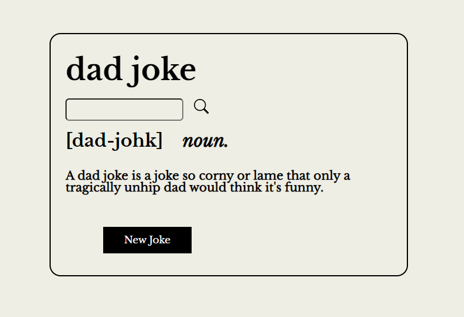
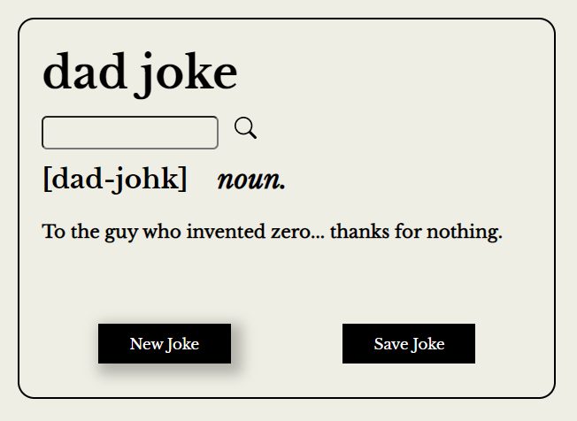
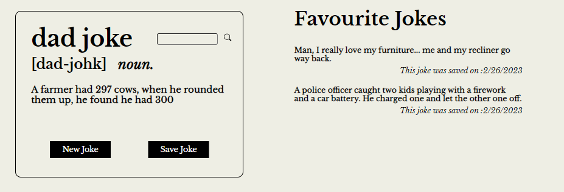
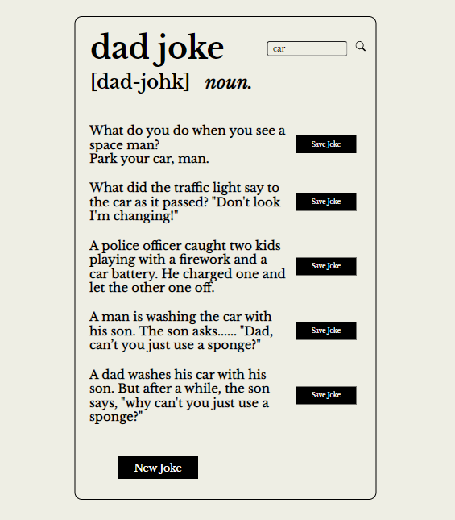
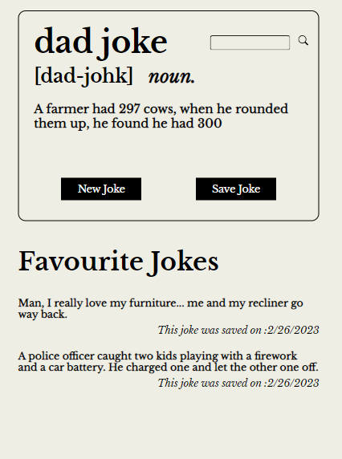

# Dad Jokes

## JavaScript DOM, Web API, Responsive Design

<br>



<br><br>

### The "New Joke" button pulls a random new joke from the Web API



<br><br>

### The "Save Joke" button adds the joke to the "Favourite Jokes" section



<br><br>

### Search for jokes based on keyword



<br><br>

### The Dad Jokes app is fully responsive for mobile, tablet and desktop views




<br><br><br>

## Setup

1. Clone this repository.
2. In the terminal, run the following command to install dependencies

```sh
npm i
```

3. Run the Dad Jokes app on your local server
